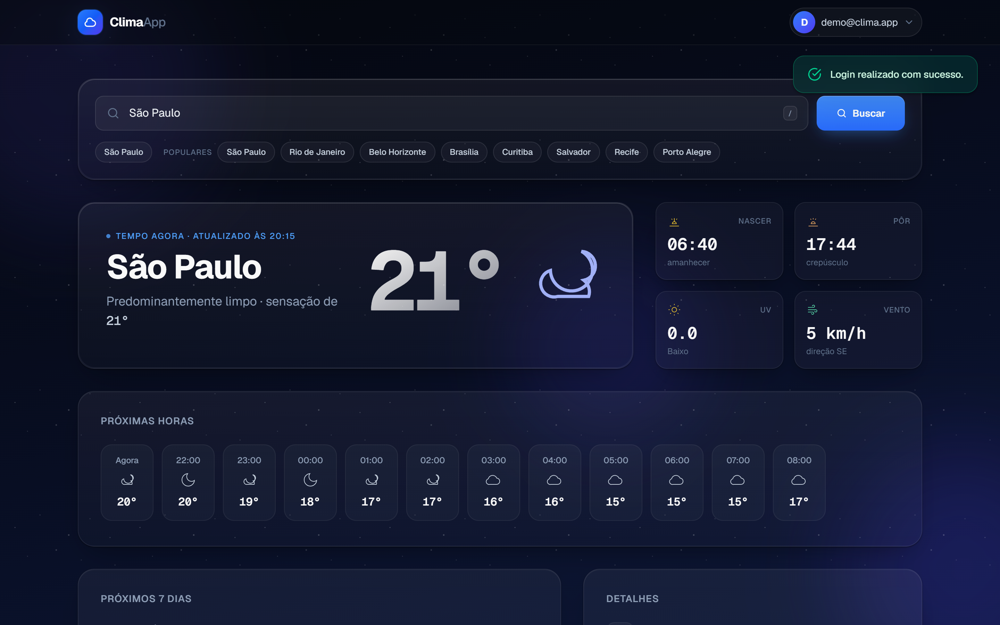
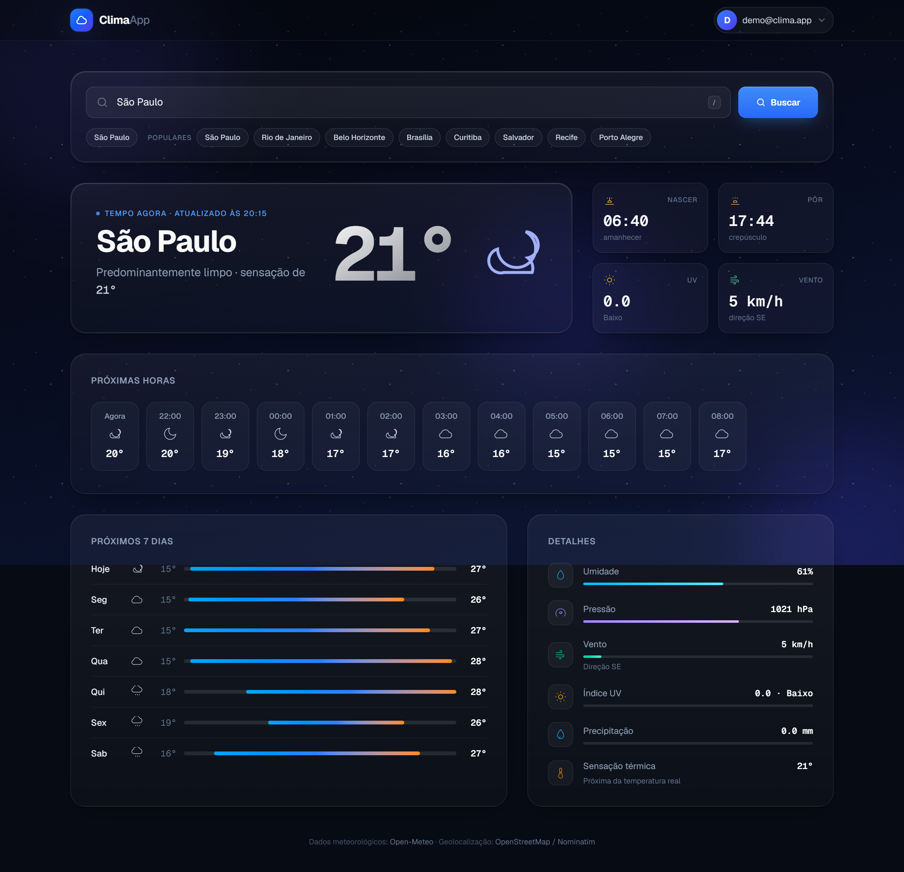
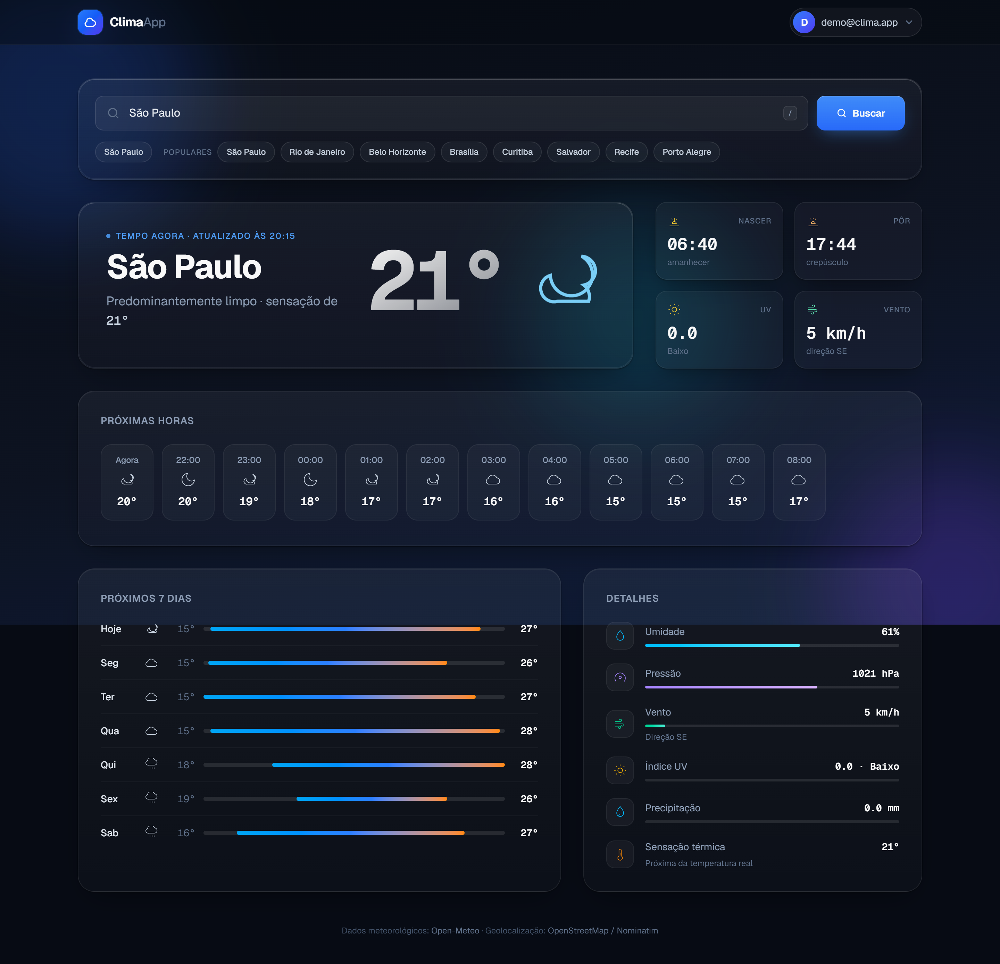
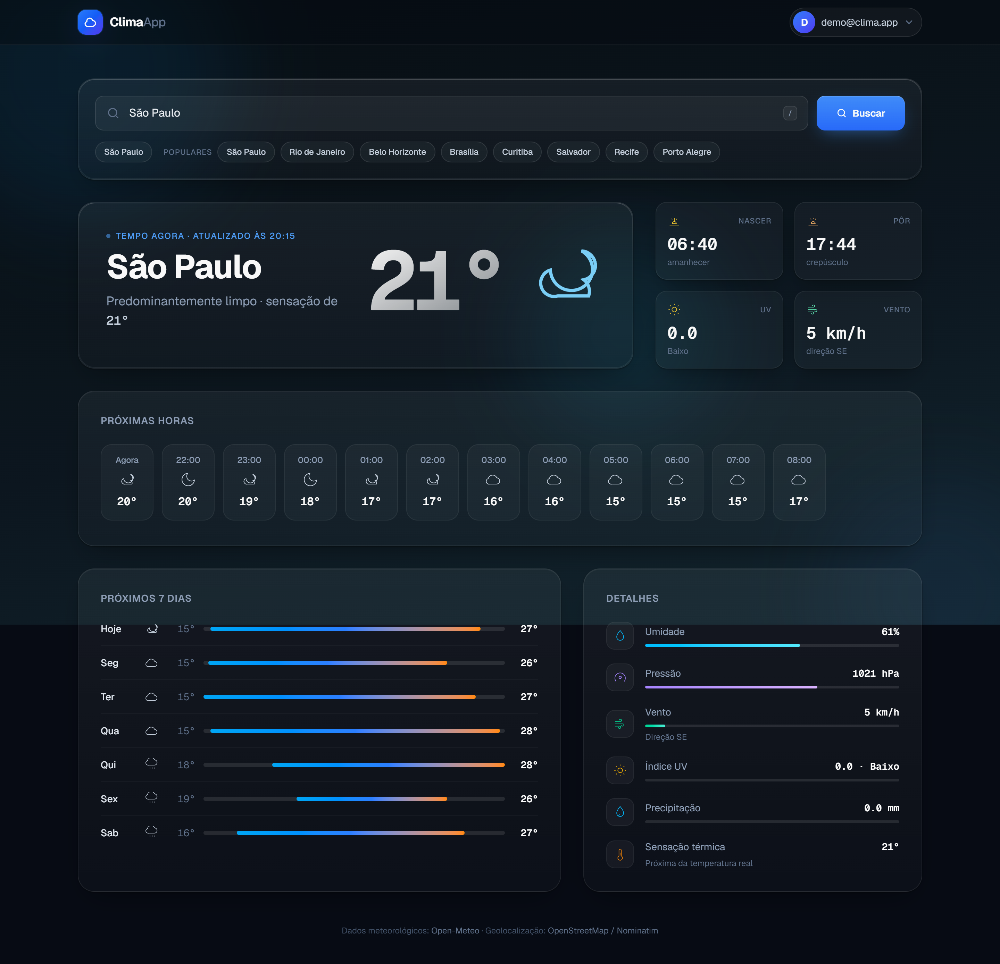
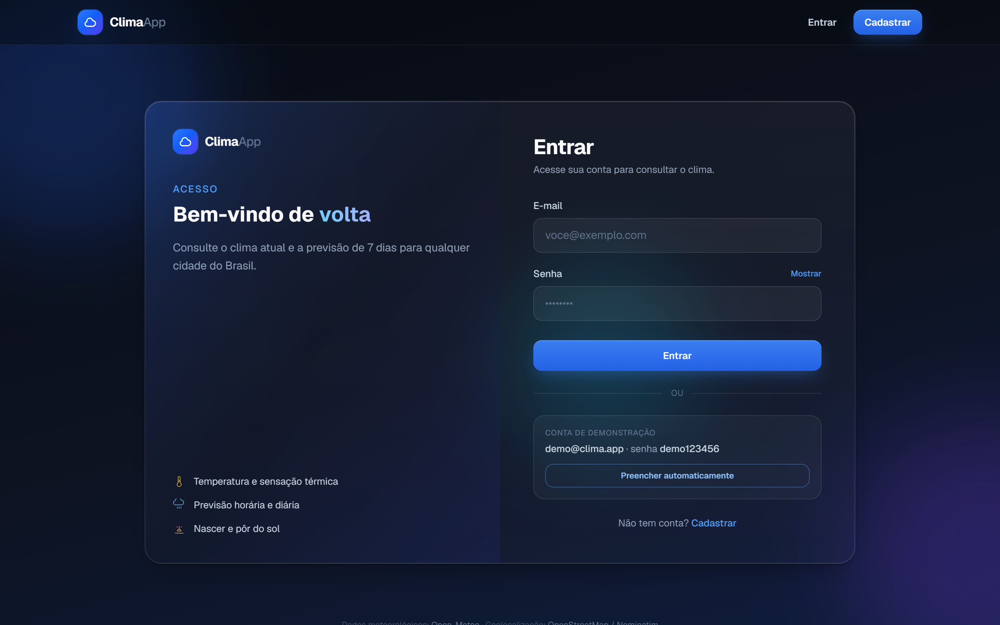
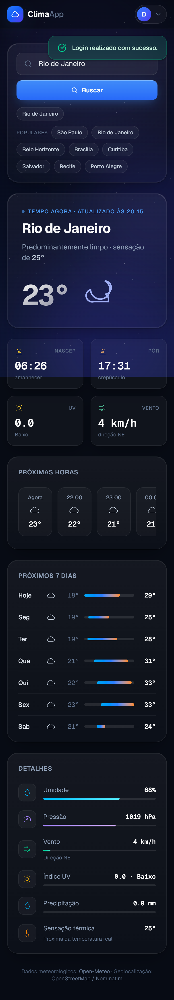

<div align="center">

# Clima App

**Tempo real para qualquer cidade do Brasil.**

Um dashboard de clima premium construído com Ruby on Rails, Tailwind CSS e Hotwire — com tema ambiental que se adapta à condição do tempo, previsão horária e de 7 dias, e uma experiência visual pensada nos mínimos detalhes.

<p align="center">
  
  
  
  
  
</p>



</div>

---

## Índice

- [Visão geral](#visão-geral)
- [Screenshots](#screenshots)
- [Funcionalidades](#funcionalidades)
- [Design & UX](#design--ux)
- [Stack tecnológica](#stack-tecnológica)
- [Como funciona](#como-funciona)
- [Instalação](#instalação)
- [Testes](#testes)
- [Rotas principais](#rotas-principais)
- [Estrutura do projeto](#estrutura-do-projeto)
- [APIs externas](#apis-externas)
- [Licença](#licença)

## 🚀 Visão geral

O **Clima App** é uma aplicação web que consulta o clima em tempo real de cidades brasileiras. O usuário autenticado busca uma cidade e recebe um dashboard completo: condição atual, sensação térmica, umidade, pressão, vento, índice UV, nascer e pôr do sol, previsão hora a hora e previsão para os próximos 7 dias.

Além dos dados, o produto se destaca pela experiência visual: o fundo da aplicação **muda de ambiente conforme a condição do tempo** (sol, chuva, neblina, tempestade) e ganha um céu estrelado à noite — inspirado no Apple Weather, Vercel e Linear.

## 📸 Screenshots

| Dashboard — dia | Dashboard — noite |
|:---:|:---:|
|  |  |

| Dashboard completo | Ambiente de chuva |
|:---:|:---:|
|  |  |

| Página inicial (visitante) | Login | Cadastro | Mobile |
|:---:|:---:|:---:|:---:|
|  |  |  |  |

## ✨ Funcionalidades

- **Autenticação completa** — cadastro, login e logout com e-mail e senha (`has_secure_password` + sessão)
- **Dashboard meteorológico** — temperatura, sensação térmica, umidade, pressão, vento (com direção), índice UV e precipitação
- **Previsão hora a hora** — próximas 12 horas com temperatura, condição e probabilidade de chuva
- **Previsão de 7 dias** — com barras de amplitude entre mínima e máxima
- **Nascer e pôr do sol** — exibidos em destaque no painel lateral
- **Tema ambiental** — o fundo da aplicação se adapta à condição climática (sol, chuva, neve, neblina, tempestade) e exibe céu estrelado à noite
- **Buscas recentes** — histórico salvo no navegador (`localStorage`) com acesso em um clique
- **Cidades populares** — atalhos rápidos para São Paulo, Rio de Janeiro, Belo Horizonte, entre outras
- **Atalho de teclado** — pressione `/` para focar a busca e `Esc` para limpar

## 🎨 Design & UX

- **Glassmorphism refinado** — camadas de vidro com bordas em gradiente, blur e brilho interno
- **Tipografia Geist + Geist Mono** — a fonte da Vercel, com números em mono para leitura técnica imediata
- **Microinterações** — contagem animada da temperatura, skeleton shimmer no carregamento, fade-in em cascata dos blocos, navbar com blur progressivo ao rolar
- **Acessibilidade** — skip-link, `focus-visible`, ARIA (`role=menu`, `aria-live`, `aria-expanded`) e suporte total a `prefers-reduced-motion`
- **Responsividade** — layouts dedicados para mobile, tablet e desktop
- **Ícones meteorológicos SVG** — conjunto próprio de 10 ícones vetoriais (sem emojis dependentes de sistema operacional)

## 🛠 Stack tecnológica

| Camada | Tecnologia |
|--------|------------|
| Backend | Ruby 3.3.8, Rails 7.1 |
| Banco de dados | PostgreSQL |
| Frontend | ERB, Tailwind CSS 4, Hotwire Turbo |
| JavaScript | Importmap (sem bundler Node) |
| Autenticação | `has_secure_password` + sessão |
| APIs externas | Nominatim (OpenStreetMap) e Open-Meteo |

## 🔄 Como funciona

1. Visitante acessa a home e é convidado a entrar ou criar conta.
2. Após autenticar, informa o nome de uma cidade (ou usa um atalho popular/recente).
3. O backend resolve as coordenadas no **Nominatim** (busca restrita ao Brasil).
4. Com latitude/longitude, consulta o **Open-Meteo** e monta o dashboard (condição atual, previsão horária e diária).
5. O endpoint `GET /buscar_clima` responde **fragmento HTML server-rendered** (parciais em `app/views/components/`) ou JSON — o dashboard é injetado sem recarregar a página via `fetch`.
6. O fragmento informa o tema ambiental (`data-weather`), e o fundo da aplicação transiciona suavemente para a condição do tempo.

## 💻 Instalação

### Requisitos

- Ruby 3.3.8 (veja `.ruby-version`)
- PostgreSQL em execução
- Bundler

Credenciais padrão do banco em `config/database.yml`: usuário `postgres`, senha `postgres`, host `localhost`. Ajuste conforme seu ambiente.

### Passo a passo

```bash
git clone https://github.com/Rodriguesoseas/clima_app.git
cd clima_app
bin/setup
bin/rails db:seed
```

O script `bin/setup` instala as gems, prepara o banco e limpa logs/temporários.

### Desenvolvimento

Com Tailwind em watch e servidor Rails:

```bash
bin/dev
```

Apenas o servidor (CSS já compilado):

```bash
bin/rails server
```

Acesse [http://localhost:3000](http://localhost:3000).

### Usuário de demonstração

Após `db:seed`:

| Campo | Valor |
|-------|-------|
| E-mail | `demo@clima.app` |
| Senha | `demo123456` |

## 🧪 Testes

```bash
bin/rails test
```

Suíte com **9 testes e 32 assertions**, cobrindo:

- Fluxos de cadastro e login (incluindo e-mail duplicado e redirecionamentos)
- Home autenticada (busca, cidades populares, skeleton)
- Endpoint `buscar_clima` em HTML e JSON (com `WeatherService` stubado, sem dependência de rede)
- Autenticação obrigatória no endpoint de clima

## 🗺 Rotas principais

| Método | Caminho | Descrição |
|--------|---------|-----------|
| GET | `/` | Home (dashboard de busca se logado) |
| GET | `/login` | Formulário de login |
| POST | `/login` | Autenticação |
| DELETE | `/logout` | Encerrar sessão |
| GET | `/cadastro` | Novo usuário |
| POST | `/cadastro` | Criar conta |
| GET | `/buscar_clima` | Clima de uma cidade — HTML fragment ou JSON (autenticado) |
| GET | `/up` | Health check |

## 📁 Estrutura do projeto

```
app/
  controllers/     # sessions, users, weather (respond_to HTML + JSON)
  helpers/         # weather_helper (ícones SVG, condições, tema)
  javascript/
    modules/       # weather (busca), theme (ambiente), motion, ui
  models/          # User
  services/        # WeatherService (Nominatim + Open-Meteo)
  views/
    components/    # partials do dashboard (hero, horária, diária, detalhes)
    layouts/       # layout com toasts, skip-link e camadas ambientais
    sessions/      # login
    users/         # cadastro
    weather/       # home
screenshots/       # imagens para apresentação/portfólio
test/              # testes de controllers e integração
```

## 🔌 APIs externas

- **Nominatim** (OpenStreetMap): a política de uso exige `User-Agent` identificável — o serviço envia `ClimaApp/1.0`. Respeite os limites de taxa em ambientes com muitos usuários.
- **Open-Meteo**: sem chave de API para uso básico de previsão atual.

## 📄 Licença

Distribuído sob a licença **MIT**. Consulte o arquivo `LICENSE` para mais informações.
